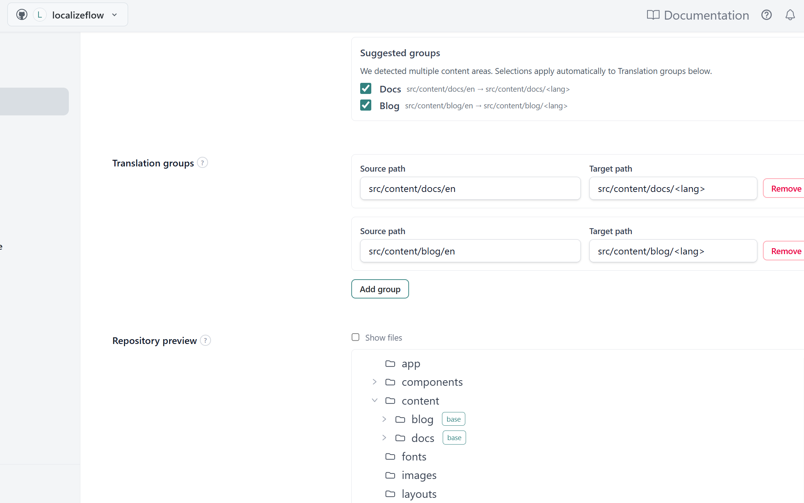
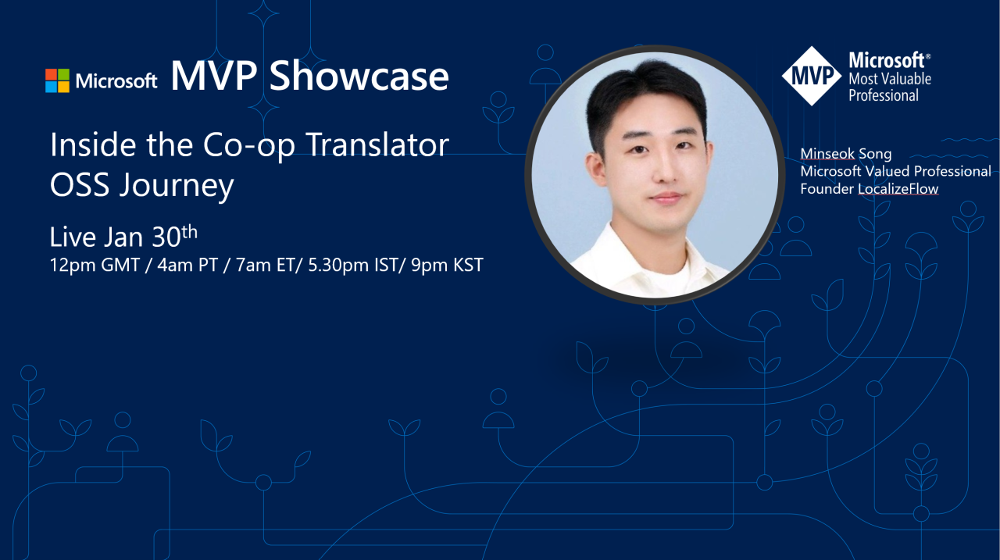
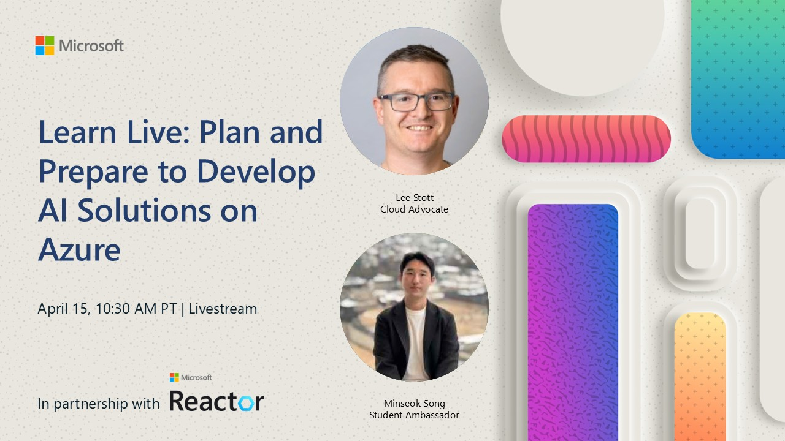

# Hi, I'm Minseok Song

I started programming at 10 by building and publishing browser-based Flash games.

Watching real people use what I made taught me a lesson that still shapes my work: software becomes meaningful when it survives contact with real users.

Today, I build AI systems that survive real workflows. I work on multilingual documentation, GitHub-native automation, and reliable LLM operations.

[Microsoft MVP in Microsoft Foundry](https://mvp.microsoft.com/mvp/profile/78bed86f-8f4b-41f9-ba0c-b707ec42e08c)

## Building now

- **[Azure / co-op-translator](https://github.com/Azure/co-op-translator)** — open-source tooling for translating Markdown, notebooks, and images while preserving structure and review loops.
- **[Localizeflow](https://localizeflow.com)** — production infrastructure for continuously maintaining multilingual documentation through GitHub pull requests.

## Featured work

<table>
  <tr>
    <td width="50%" valign="top">
      
       <strong>Localizeflow</strong>
       GitHub-native orchestration for multilingual documentation.
    </td>
    <td width="50%" valign="top">
      
       <strong>Open at Microsoft</strong>
       Making technical documentation accessible across languages.
    </td>
  </tr>
  <tr>
    <td width="50%" valign="top">
      
       <strong>Microsoft MVP Showcase</strong>
       The Co-op Translator journey from prototype to production.
    </td>
    <td width="50%" valign="top">
      
       <strong>Microsoft Learn Live</strong>
       Planning maintainable AI solutions before implementation.
    </td>
  </tr>
</table>

Latest writing: **[Progress Bar Is Not an API](https://www.mssong.com/writing/progress-bar-is-not-an-api-coop-translator-events/)** — separating human-facing CLI output from machine-readable events.

> Reliable LLM automation is not about getting everything right on the first attempt. It is about detecting failures, adapting the strategy, and making unresolved problems visible.

This work currently spans **18 repositories**, **55 languages**, and more than **44 million processed words**.

[Website](https://www.mssong.com/) · [Writing](https://www.mssong.com/writing/) · [Talks](https://www.mssong.com/talks/) · [LinkedIn](https://www.linkedin.com/in/ms-song/)
